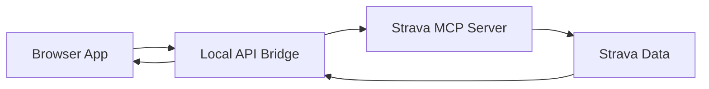
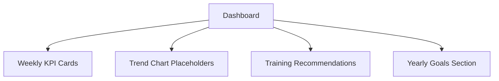
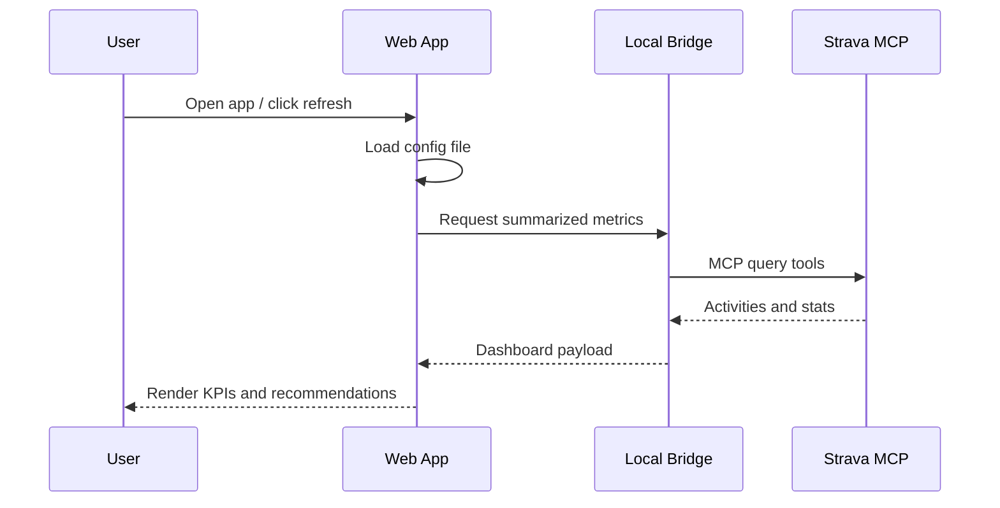

# Strava Web App Skeleton

## High-level Flow

## Initial Dashboard Blocks

## Data Lifecycle (Skeleton)

## Notes

- Keep browser credentials out of client-side code.
- Use a local bridge/service to call MCP tools securely.
- The current app is a skeleton with placeholders for values.
